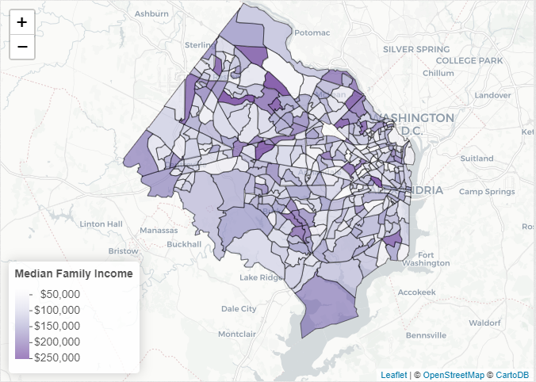

# Mapping Median Household Income by Census Tract in Northern Virginia

This is a tutorial I put together at work to show how to plot American Community Survey data using Leaflet in R. Below is a preview of the map I created. The full interactive javascript map can be found at my RPubs page.

# [My tutorial can be found on RPubs here](http://rpubs.com/grieves_c/nova-median-income-map)

